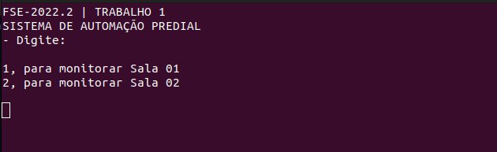
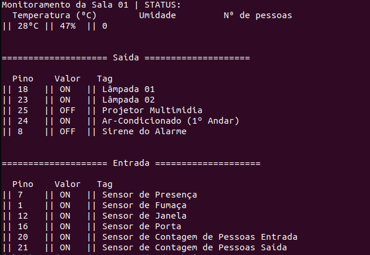

# FSE-2022/2
Trabalho 1 de Fundamentos de Sistemas Embarcados

Aluno   | Matrícula
--------- | ------
João Victor Teixeira Batista | 190109963

## Objetivo 
Este trabalho tem por objetivo a criação de um sistema distribuído de automação predial para monitoramento e acionamento de sensores e dispositivos de um prédio de 2 andares. O sistema deve ser desenvolvido para funcionar em um conjunto de placas Raspberry Pi com um servidor central responsável pelo controle e interface com o usuário e servidores distribuídos para leitura e acionamento dos dispositivos. Dentre os dispositivos envolvidos estão o monitoramento de temperatura e umidade, sensores de presença, sensores de fumaça, sensores de contagem de pessoas, sensores de abertura e fechamento de portas e janelas, acionamento de lâmpadas, aparelhos de ar-condicionado, alarme e aspersores de água em caso de incêndio.

## Links importantes
Para acessar o repositório template para o trabalho apresentado, clique [aqui](https://gitlab.com/fse_fga/trabalhos-2022_2/trabalho-1-2022-2). 

## Prints 
### Servidor Central 

### Servidor Distribuído 

(Imagem ilustrativa, servidor distribuído não apresenta comportamento esperado)

## Execução

> Na pasta de cada servidor (`centralServer` e `distServer`) crie uma pasta chamada bin:

    mkdir bin
> Execute na pasta raiz do servidor:
    
    make
> Execute o comando:

    ./bin/bin
